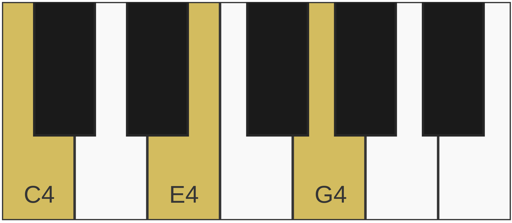

# PhpSvgPiano  

PhpSvgPiano is a PHP library for generating SVG representations of a piano keyboard with customizable styles and note highlights.  

## Introduction  

PhpSvgPiano allows you to generate an SVG representation of a piano keyboard, with flexible customization options for key colors, text styles, and octave ranges. It is object-oriented, making it easy to manipulate and configure.  

> PhpSvgPiano was inspired by the [Svguitar](https://github.com/omnibrain/svguitar) library and brings a similar SVG-based approach to piano visualization.

### Features  

- Generate a scalable SVG piano keyboard  
- Highlight pressed keys  
- Customize key colors and text styles  
- Define octave range and accidental preferences  
- Object-oriented and easy to extend  

## Installation  

Install via Composer:  

```sh
composer require ucscode/php-svg-piano
```

## Usage  

### Basic Example  

```php
use Ucscode\PhpSvgPiano\Piano;

$piano = new Piano("C4 E4 G4");
echo $piano->render();
```

This will generate an SVG with C4, E4, and G4 pressed.  



---

## Documentation  

The documentation covers basic information from installation and usage to advanced configuration and customization options.  

For detailed information, visit the full documentation: [Read Here](./docs/index.md).

---

## Customization  

### Customizing Key Styles  

```php
use Ucscode\PhpSvgPiano\Configuration;
use Ucscode\PhpSvgPiano\Pattern\KeyPattern;
use Ucscode\PhpSvgPiano\Pattern\TextPattern;
use Ucscode\PhpSvgPiano\Piano;

$config = new Configuration();
$config->setNaturalKeyPattern(new KeyPattern(0, 0, '#ff0000', '#000000', 2)); // Red keys
$config->setAccidentalKeyPattern(new KeyPattern(0, 0, '#000000', '#ff0000', 2)); // Black keys with red border
$config->setShowPressedKeyText(true);

$piano = new Piano("C4 D#4 G5", $config);
echo $piano->render();
```

This will generate a piano with red natural keys, black accidentals with a red stroke, and visible text on pressed keys.  

---

## Contributing  

Contributions are welcome. Feel free to:  

- Report issues  
- Submit feature requests  
- Fork and improve the library  

---

## License  

This project is licensed under the MIT License. See the [LICENSE](LICENSE) file for details.  

### Inspiration

PhpSvgPiano was inspired by the [Svguitar](https://github.com/omnibrain/svguitar) library, which provides an SVG-based approach for rendering guitar chord diagrams. This project extends the concept to the piano, offering a flexible and object-oriented solution for generating customizable SVG piano keyboards.  
