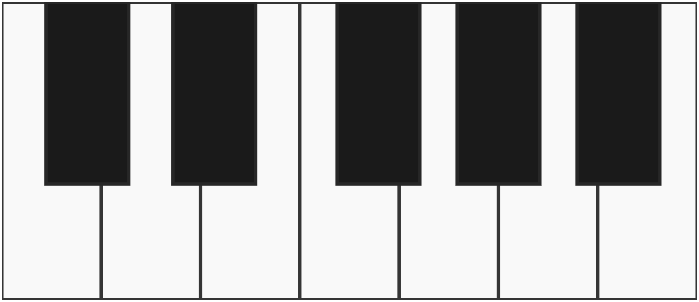
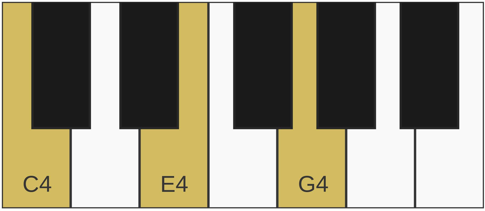
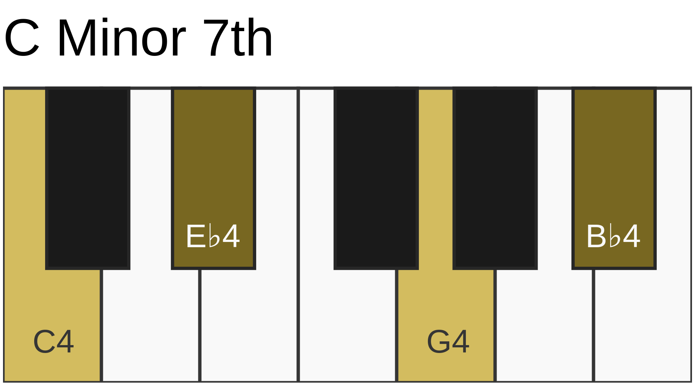

## Getting Started

This section will guide you through installing and using the PHP SVG Piano Generator to generate an SVG piano diagram.

### Installation

To install the library, use Composer:

```bash
composer require your-namespace/php-svg-piano-generator
```

Ensure your PHP version is **8 or higher**.

### Quick Start Example

The library allows you to generate a piano diagram with just a few lines of code:

```php
<?php
require 'vendor/autoload.php';

use Ucscode\PhpSvgPiano\Piano;
use Ucscode\PhpSvgPiano\Option;

// Render a basic piano diagram.
echo (new Piano())->render();
```

#### Output



### Piano + Cmaj Chord

You can render the piano while pressing down a note or  chord

```php
// Render a piano diagram with the C major chord (C, E, G) pressed.
echo (new Piano())->render('C, E, G');
```

#### Output



### Piano + Title

You can also render the piano with a title

```php
// Customize the piano with a title.
echo (new Piano())->render('C, E_, G, B_', 'C Minor 7th');
```

#### Output



### Customizing the Piano

The `Piano` class supports customization using the `Configuration` and `Option` classes:

- **Configuration**: Defines rendering settings such as key size, text visibility, and octave range.
- **Option**: Allows setting additional details like a piano title.

By default, `Piano` uses a standard configuration, but you can pass a custom `Configuration` instance when creating a new piano.

---

[Back to Documentation Scheme](./index.md)
